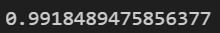
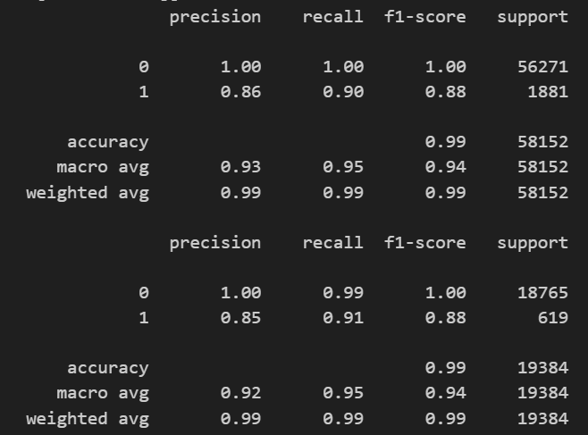
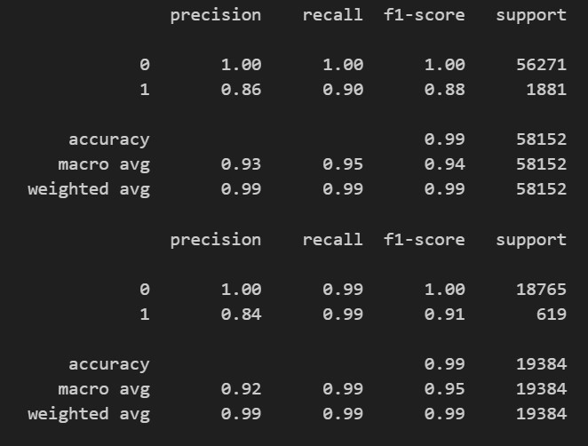

# credit-risk-classification
------------
## Overview of the Analysis
### Goal
Utilize sklearn to assess loans to determine how risky the loan is. Historical lending data is used for the dataset to create a supervised machine learning model to predict credit risk for loans.

-   The dataset was imported and split into the target variable/labels (loan_status) and the features (which are the other
    columns that will be used by the model to predict the value of the target variable).
-   Value_counts is used to assess the number of results in the labels that are 0 or 1 to visualize the balance of the labels.
-   The data is split using train_test_split so we can fit the model based on the train variables and assess if the predictions
    that were made using the model, applied to the test data, were accurate, precise and had adequate recall.
-   The logistic regression model was used. The model was created with a random state of 1, fit to the train data, and used to
    predict the loan_status of the test data.
-   The model's performance was evaluated by checking the balanced accuracy score of the model, using a confusion matrix, and 
    generating classification reports for the test and train predictions.
-   A second model, RandomOverSampler, was used to resample the train data so that the labels have an even split of 0 and 1 
    data points.
-   The same steps of initiating the model, fitting the model to the train data, predicting the test values, generating an 
    accuracy score, confusion matrix and classification reports were followed, the same as the logistic regression model 
    without the oversampled data.

-   Below are the classification reports and accuracy scores for the two models:

## Logistic Regression with Test Train Split

## Random OverSampler

- Machine Learning Model 1:
    -   Good precision and recall for the healthy loans.
    -   Below acceptable precision and recall (below 95%) for the high risk loans. 
    -   The accuracy score is 99.1%, which is acceptable.
-   Machine Learning Model 2:
    -   Utilize RandomOverSampler for training data.
    -   Much better recall for the high risk loans, which indicates fewer false positives.
    -   The precision was low for the high risk loans. 
    -   This model still had high precision and recall for the healthy loans. 
    -   The accuracy score was higher, 99.3%, than the first model. 

## Summary

Both machine learning models had high accuracy with high precision and recall for the healthy loans. Both models struggled to predict the high risk loans with precision. The main difference between the models was the recall of the high risk loans. If these precision scores were part of a high risk model, ie healthcare, I would not recommend either model. Credit risk is lower risk, so I would recommend using the oversampled model due to it's higher accuracy and recall indicating that this model performed better.
------------
------------
## Softwares Used
### Libraries
Numpy
Pandas
pathlib
    Path
sklearn.metrics
    balanced_accuracy_score
    confusion_matrix
    classification_report
sklearn.model_selection
    train_test_split
sklearn.linear_model
    LogisticRegression
imblearn.over_sampling
    RandomOverSampler

### Languages
Python

### Software
VSCode
GitLens

